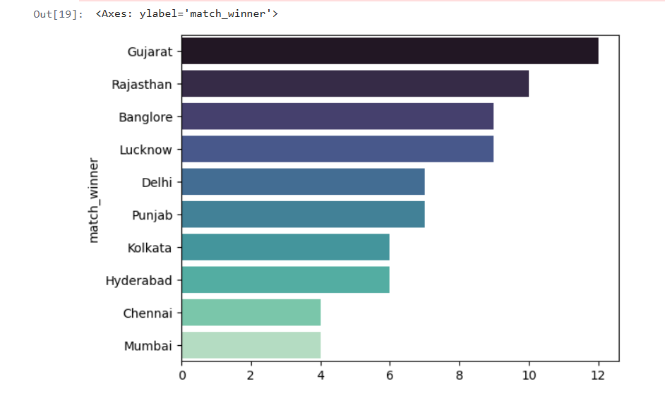
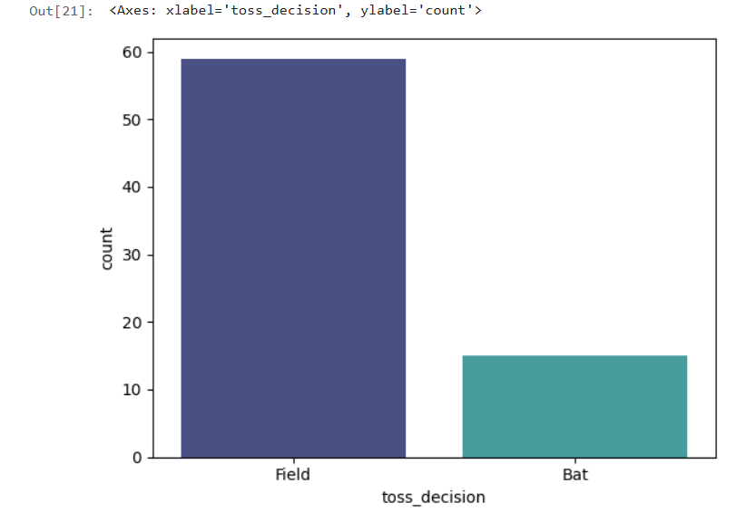
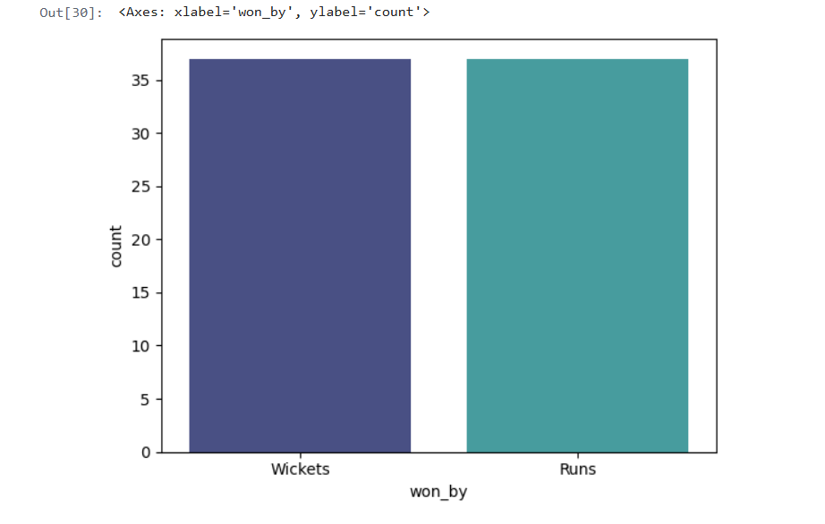
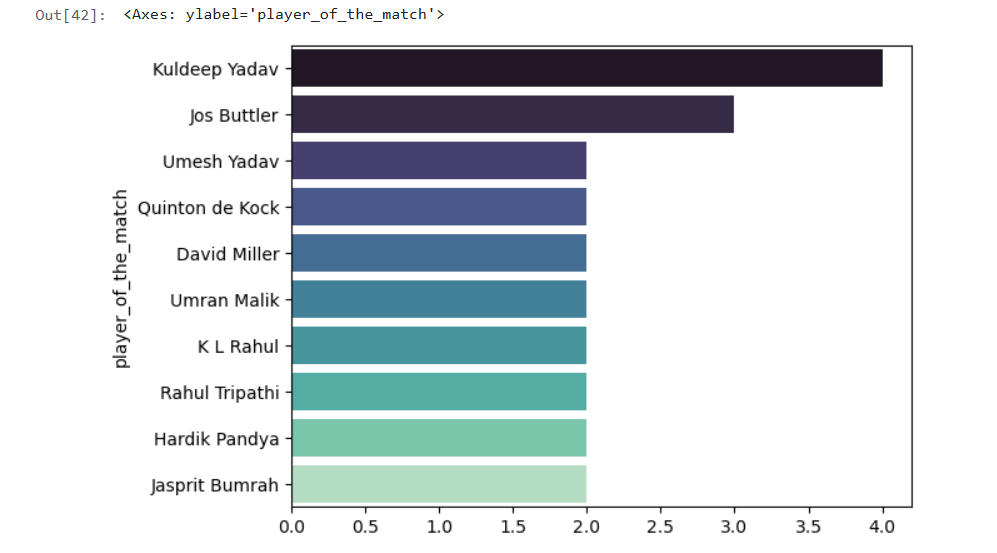
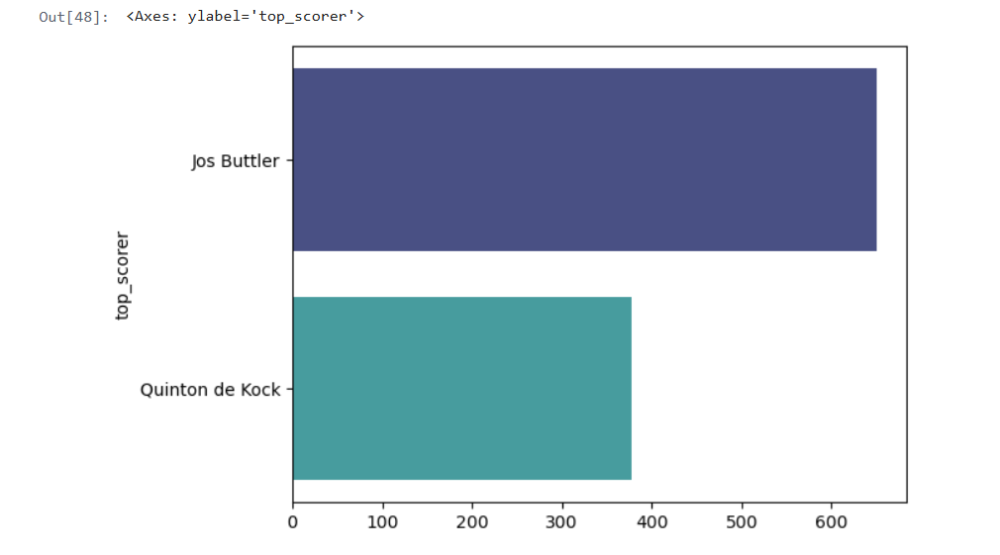
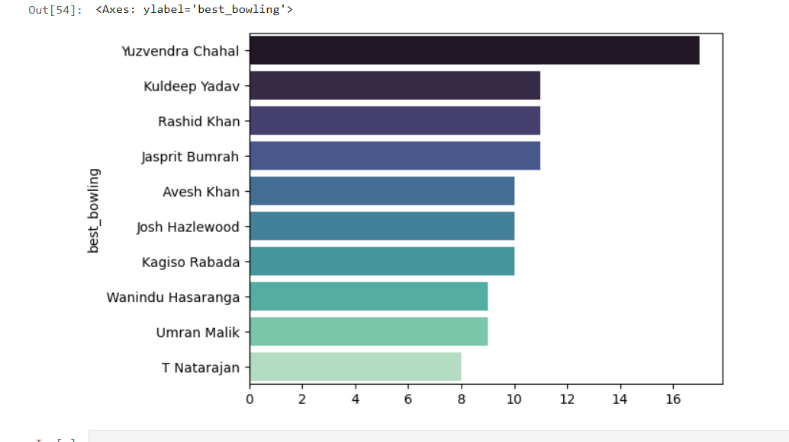

# 🏏 IPL 2022 Data Visualization

This mini project explores **IPL match data** using Python (Pandas, Matplotlib and Seaborn) to answer key questions about team performances, toss decisions, batting/bowling dominance, and individual achievements.

The visualizations provide insights into trends and patterns across different seasons of the Indian Premier League (IPL).

---

## 📌 Key Questions Answered

### 1. Which team won the most matches?

**Gujarat** has won the most matches.



---

### 2. Toss Decision Trends

Teams usually **prefer fielding after winning the toss**.


---

### 3. Toss Decision vs Match Winner

## **Winning the toss does not increase winning chances** — in fact, teams have **less chance of winning after winning the toss**.

### 4. How Do Teams Win? (Runs vs Wickets)

Teams have **equal chances of winning by runs or wickets**.



---

### 5. Most Player of the Match Awards

Kuldeep Yadav stands out with the **maximum Player of the Match awards**, showcasing his consistent match-winning performances.



---

### 6. Top 2 Scorers

**Jos Buttler** and **Quinton de Kock** were the top two performers with the most runs.



---

### 7. 10 Best Bowling Figures

**Yuzvendra Chahal** has the best bowling figure.



---

## 🛠️ Tech Stack

- **Python**
- **Pandas** – Data cleaning & manipulation
- **Matplotlib / Seaborn** – Data visualization
- **Jupyter Notebook** – Interactive analysis

---

---

## 🚀 How to Run

1. Clone this repository:

   ```bash
   git clone https://github.com/yourusername/ipl-data-visualization.git
   ```

2. Install dependencies:

```
pip install -r requirements.txt
```

3. Open Jupyter Notebook:

```
jupyter notebook
```

## Future Work

- Add season-wise analysis (2008–2023).
- Interactive dashboards (using Plotly or PowerBI).
- Player/team comparisons using advanced metrics.
